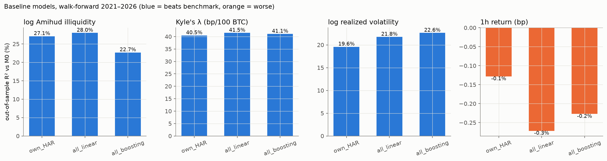
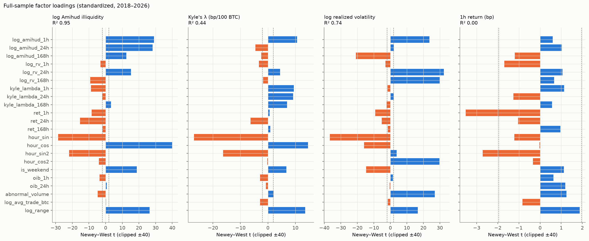
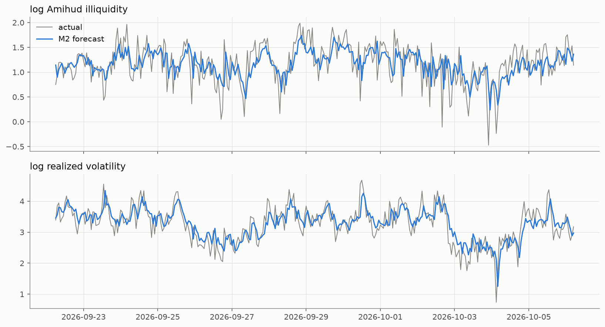
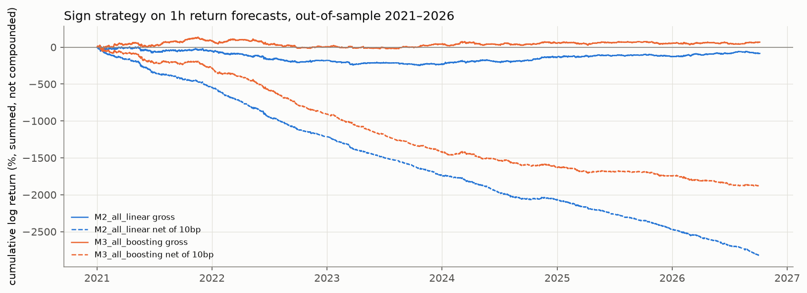

# 베이스라인 팩터 모형 (감성지수 제외)

- 데이터: Binance BTCUSDT 1분봉 → 1시간, 학습 시작 2018-01-01, 사용 가능 76,478시간
- 검증: 워크포워드 — 2021~2026년 각 해를 그 이전 데이터로만 학습한 모형으로 예측
- 모형: M0 단순 기준(유동성 = 직전 값, 수익률 = 0) / M1 자기 과거값(HAR)+시간 패턴 / M2 전체 팩터 선형 / M3 전체 팩터 부스팅
- 재현: `python src/analyze_baseline_factors.py` / 정의: `src/baseline_factors.py`

## 1. 유동성·변동성 예측 — 잘 된다 (기대 유동성으로 사용 가능)

표본 외 R²는 M0(직전 값을 그대로 쓰는 예측) 대비 오차 감소율. DM = Diebold–Mariano 검정 (단측, 모형이 M0보다 정확).

### log Amihud 비유동성
|           model |   n_hours |   rmse |   oos_r2_vs_M0 |   dm_stat |   dm_p |   corr_actual_forecast |
|----------------:|----------:|-------:|---------------:|----------:|-------:|-----------------------:|
|    M0_benchmark |    50,471 | 0.3237 |              0 |           |        |                 0.8507 |
|      M1_own_HAR |    50,471 | 0.2764 |          0.271 |     53.72 |      0 |                 0.8845 |
|   M2_all_linear |    50,471 | 0.2747 |           0.28 |     53.86 |      0 |                 0.8863 |
| M3_all_boosting |    50,471 | 0.2846 |         0.2268 |     23.67 |      0 |                 0.8783 |

### Kyle's λ (bp / 100 BTC)
|           model |   n_hours |   rmse |   oos_r2_vs_M0 |   dm_stat |   dm_p |   corr_actual_forecast |
|----------------:|----------:|-------:|---------------:|----------:|-------:|-----------------------:|
|    M0_benchmark |    50,471 |  21.32 |              0 |           |        |                 0.4139 |
|      M1_own_HAR |    50,471 |  16.45 |         0.4046 |     44.74 |      0 |                 0.5498 |
|   M2_all_linear |    50,471 |  16.31 |         0.4147 |     44.76 |      0 |                 0.5608 |
| M3_all_boosting |    50,471 |  16.37 |         0.4106 |     42.96 |      0 |                 0.5563 |

### log 실현변동성
|           model |   n_hours |   rmse |   oos_r2_vs_M0 |   dm_stat |   dm_p |   corr_actual_forecast |
|----------------:|----------:|-------:|---------------:|----------:|-------:|-----------------------:|
|    M0_benchmark |    50,471 | 0.3808 |              0 |           |        |                 0.8348 |
|      M1_own_HAR |    50,471 | 0.3415 |         0.1958 |     40.67 |      0 |                 0.8573 |
|   M2_all_linear |    50,471 | 0.3369 |         0.2175 |     45.96 |      0 |                 0.8614 |
| M3_all_boosting |    50,471 |  0.335 |         0.2263 |     34.56 |      0 |                 0.8634 |

**해석**
- 세 지표 모두 M1(자기 과거값 + 시간 패턴)만으로 M0 대비 오차가 크게 줄어든다 → 유동성·변동성은 **강한 지속성 + 하루 주기**를 가진다.
- M2(다른 팩터 추가)의 개선폭: Amihud +0.9%p,
  Kyle's λ +1.0%p,
  변동성 +2.2%p.
- M3(부스팅) − M2(선형) 차이: Amihud -5.3%p,
  Kyle's λ -0.4%p,
  변동성 +0.9%p
  → 비선형 모형의 이득이 없거나 미미하다. 선형 HAR 구조로 충분하므로 해석이 쉬운 **M2를 1월 이벤트 분석의 기대 유동성 모형으로 채택**.
- 참고: 부스팅은 처음에 Amihud에서 M0보다도 못했다(R² −17%). Amihud가 해마다 낮아져 테스트 구간이 학습 범위 밖으로 나갔기 때문
  (트리는 본 적 없는 범위를 예측 못 함) → '최근 1주 평균 대비 편차'를 학습하도록 고쳐 해결.
- Kyle's λ는 M0 대비 개선폭(R²)은 가장 크지만, 1시간(60개 1분봉) 회귀로 추정한 값이라 측정 잡음 자체가 크다
  (직전 값과의 상관 0.41, 예측값과 실제의 상관 0.56 — Amihud·변동성은 0.86 이상)
  → 이벤트 분석에서는 Amihud·변동성을 주 지표로, λ는 보조로.

## 2. 가격(1시간 수익률) 예측 — 사실상 안 된다 (효율적 시장과 일치)

M0 = '수익률 0' 예측. CW = Clark–West 검정 (단측). 방향 검정 = Pesaran–Timmermann (예측·실제가 독립일 때의 적중률 `hit_rate_if_independent` 대비).
전략 = 예측 부호대로 롱/숏, 수수료 편도 10bp. 참고: 같은 기간 단순 보유(buy & hold) 샤프 = 0.32

|           model |   oos_r2_vs_M0 |   clark_west_stat |   clark_west_p |   hit_rate |   hit_rate_if_independent |   pesaran_timmermann_p |   gross_sharpe |   net_sharpe |   trades_per_day |
|----------------:|---------------:|------------------:|---------------:|-----------:|--------------------------:|-----------------------:|---------------:|-------------:|-----------------:|
|    M0_benchmark |              0 |                   |                |            |                           |                        |                |              |                  |
|      M1_own_HAR |      -0.001282 |            0.7608 |         0.2234 |     0.5223 |                    0.5007 |                      0 |         0.4175 |       -9.507 |            15.97 |
|   M2_all_linear |      -0.002716 |            0.8767 |         0.1903 |     0.5077 |                    0.5013 |               0.001403 |        -0.2535 |       -8.354 |            13.03 |
| M3_all_boosting |      -0.002272 |            0.6871 |          0.246 |     0.5047 |                    0.5023 |                 0.1153 |         0.2045 |       -5.554 |            9.241 |

### 연도별 표본 외 R² (%) — 일관성 확인
|   year |   M1_own_HAR |   M2_all_linear |   M3_all_boosting |
|-------:|-------------:|----------------:|------------------:|
|   2021 |       -0.248 |          -0.398 |            -0.424 |
|   2022 |       -0.202 |          -0.357 |            -0.359 |
|   2023 |        0.179 |          -0.170 |            -0.042 |
|   2024 |       -0.023 |          -0.129 |             0.008 |
|   2025 |       -0.013 |          -0.120 |            -0.039 |
|   2026 |       -0.047 |           0.013 |             0.228 |

**해석**
- **크기 예측은 실패**: 세 모형 모두 표본 외 R²가 음수(M0 '수익률 0'보다 못함)이고 Clark–West 검정도 유의하지 않다.
  연도별 R²도 대부분 음수로, 안정적인 예측력이 없다.
- **방향은 아주 약하게 맞춘다**: M1의 적중률 52.2%는 우연 기대치 50.1%보다 높다 (Pesaran–Timmermann p ≈ 0).
  원천은 직전 1시간 수익률의 음의 계수, 즉 **단기 반전(reversal)** 이다 (아래 3절, 1σ당 약 −2bp).
  단, PT 검정은 적중 여부가 시간마다 독립이라고 가정하므로 유의성은 다소 과대평가됐을 수 있다.
- **경제적으로는 무의미**: 반전 효과(약 2bp)가 수수료(편도 10bp)보다 훨씬 작고 하루 10회 이상 거래해야 해서
  수수료 후 샤프가 크게 음수다. 수수료 전 샤프(0.42)도 단순 보유(0.32)와 비슷한 수준.
- **결론**: 감성 없는 베이스라인으로는 1시간 가격을 실질적으로 예측할 수 없다 (효율적 시장과 일치).
  이후 감성 신호는 이 기준을 같은 검정(CW, Pesaran–Timmermann, 연도별 일관성, 수수료 후 성과)으로 **유의하게** 넘어야 한다.
  또한 단기 반전이 존재하므로, 감성 이벤트 직후 수익률을 볼 때 **직전 1시간 수익률을 통제**해야 한다.

## 3. 팩터 해석 (전체 표본 OLS, Newey–West t값, 팩터는 표준화)

계수 = 팩터 1 표준편차 변화당 대상 변화. 표본이 7만 시간이 넘어 작은 효과도 t값이 커지므로 **크기(coef)와 표본 외 성과를 함께** 볼 것.

### log Amihud — 상위 팩터
|                |     coef |   t_stat |   p_value |
|---------------:|---------:|---------:|----------:|
|       hour_cos |  0.05168 |    44.77 |         0 |
|  log_amihud_1h |   0.4844 |     29.1 |         0 |
|       hour_sin |  -0.0311 |   -28.52 |         0 |
| log_amihud_24h |   0.3889 |    28.15 |         0 |
|      log_range |   0.0841 |    26.46 |         0 |
|      hour_sin2 | -0.01944 |   -21.98 |         0 |

### Kyle's λ — 상위 팩터
|                |    coef |   t_stat |   p_value |
|---------------:|--------:|---------:|----------:|
|       hour_sin |  -1.836 |   -26.88 |         0 |
|      hour_sin2 | -0.9624 |   -16.31 |         0 |
|       hour_cos |   1.066 |    14.63 |         0 |
|      log_range |   2.728 |    13.58 |         0 |
|  log_amihud_1h |   8.641 |    10.59 |         0 |
| kyle_lambda_1h |     2.9 |    9.448 |         0 |

### log 실현변동성 — 상위 팩터
|                 |     coef |   t_stat |   p_value |
|----------------:|---------:|---------:|----------:|
|        hour_sin | -0.04967 |   -36.65 |         0 |
|      log_rv_24h |   0.1568 |    32.49 |         0 |
|     log_rv_168h |   0.3157 |    29.93 |         0 |
|       hour_cos2 |  0.03171 |     29.8 |         0 |
| abnormal_volume |   0.3096 |    26.95 |         0 |
|   log_amihud_1h |   0.4788 |    23.68 |         0 |

### 1시간 수익률 — 상위 팩터
|                 |    coef |   t_stat |   p_value |
|----------------:|--------:|---------:|----------:|
|          ret_1h |  -1.865 |   -3.521 | 0.0004295 |
|       hour_sin2 | -0.7269 |   -2.711 |  0.006705 |
|       log_range |    1.68 |    1.881 |   0.05992 |
|       log_rv_1h |  -3.674 |   -1.697 |   0.08962 |
| kyle_lambda_24h |  -1.973 |   -1.267 |    0.2051 |
| abnormal_volume |   2.334 |    1.244 |    0.2134 |

## 4. 1월 분석과의 연결

- 감성 이벤트 시각 t에 대해: **비정상 유동성 = 실제 유동성(t+1) − M2 예측값(t+1)** (예측은 t까지의 정보만 사용)
- 이 잔차는 시간대 효과·변동성 군집·직전 거래 활동이 이미 제거된 값 → CLAUDE.md §4의 "변동성 군집·계절성 혼재" 리스크 대응
- 가격은 베이스라인 예측력이 0이므로, 감성 신호의 예측력 검정 기준선 = 수익률 0 (M0)
- 한계: 1분봉 근사 지표 기반. 실시간 호가창이 쌓이면 스프레드·깊이 대상으로 같은 프레임 재적용

## 그림

| | |
|---|---|
|  |  |
|  |  |
