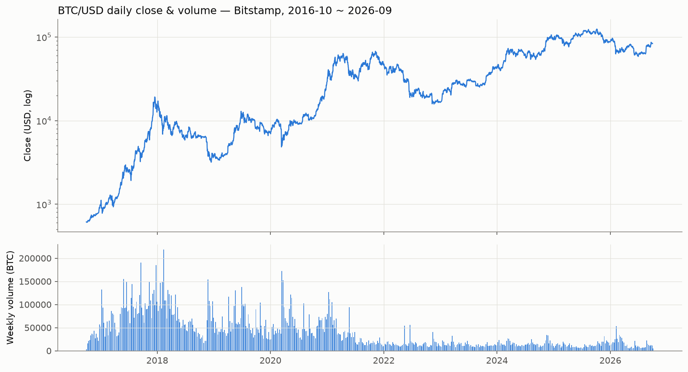
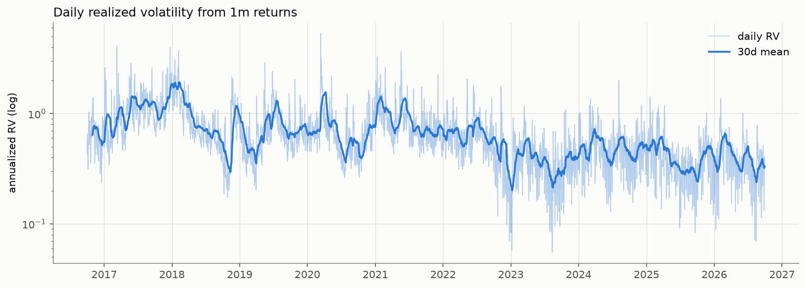
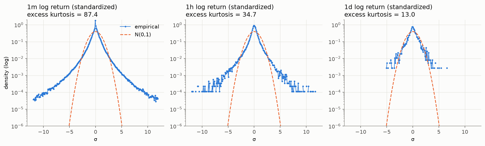
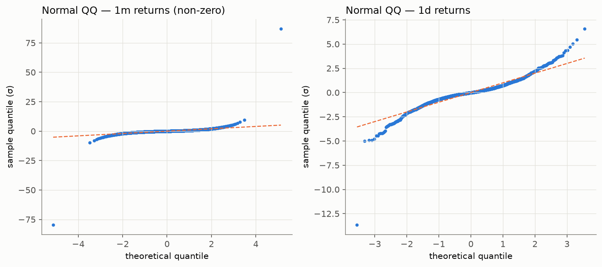
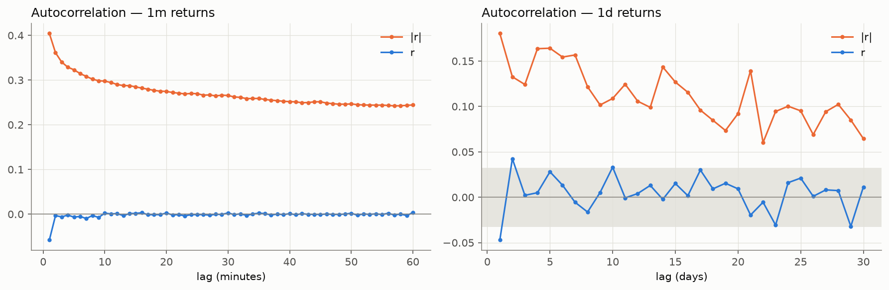
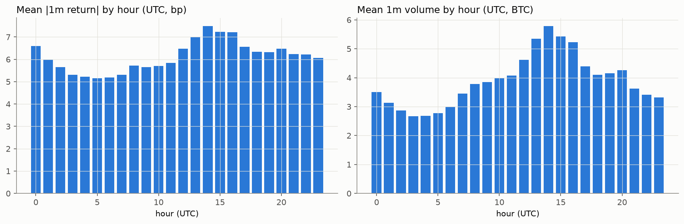
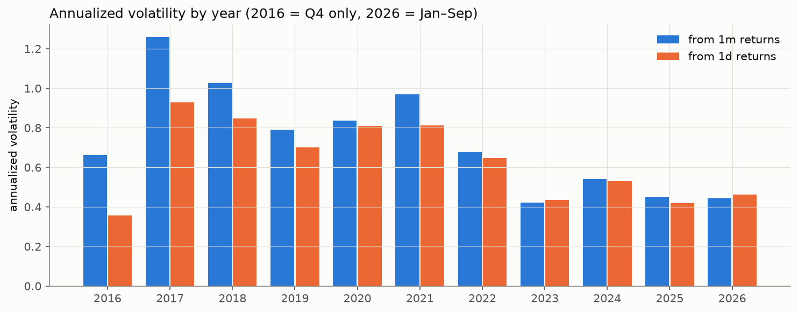
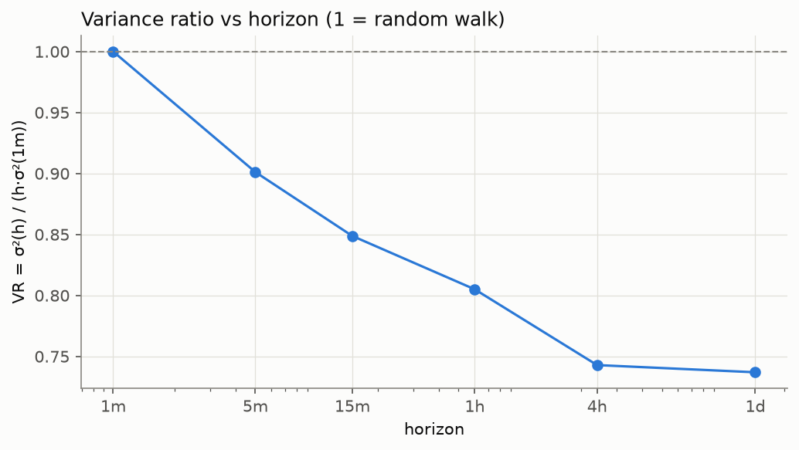

# BTC/USD 1분봉 10년 기초통계량

- 데이터: Bitstamp BTC/USD 1분봉, 2016-10-01 00:00 ~ 2026-09-30 23:59 UTC
- 관측치: 5,258,880분 (누락 0분, 거래량 0인 분 199,797분)
- 재현: `python collectors/collect_bitstamp_1m.py && python src/descriptive_stats.py`

## 1. 데이터 커버리지 (연도별)

|   year |   minutes_expected |   minutes_missing |   zero_volume_minutes |   ohlc_violations |   missing_pct |   zero_volume_pct |
|-------:|-------------------:|------------------:|----------------------:|------------------:|--------------:|------------------:|
|   2016 |            132,480 |                 0 |                48,875 |                 0 |             0 |              36.9 |
|   2017 |            525,600 |                 0 |                42,269 |                 0 |             0 |              8.04 |
|   2018 |            525,600 |                 0 |                19,827 |                 0 |             0 |              3.77 |
|   2019 |            525,600 |                 0 |                17,261 |                 0 |             0 |              3.28 |
|   2020 |            527,040 |                 0 |                 8,146 |                 0 |             0 |              1.55 |
|   2021 |            525,600 |                 0 |                 3,662 |                 0 |             0 |             0.697 |
|   2022 |            525,600 |                 0 |                13,998 |                 0 |             0 |              2.66 |
|   2023 |            525,600 |                 0 |                20,735 |                 0 |             0 |              3.95 |
|   2024 |            527,040 |                 0 |                17,565 |                 0 |             0 |              3.33 |
|   2025 |            525,600 |                 0 |                 5,918 |                 0 |             0 |              1.13 |
|   2026 |            393,120 |                 0 |                 1,541 |                 0 |             0 |             0.392 |

> 2016~2017 초기에는 거래 없는 분(volume=0, 직전 종가 유지)의 비중이 높아 1분 수익률에 0이 많이 섞인다.
> 미시구조 분석 시 초기 구간의 1분 해상도 지표는 해석에 주의.

## 2. 시간 단위별 로그수익률 분포

|     |         n |      mean |      std |   ann_vol |    skew |   excess_kurtosis |      min |     max |   zero_share |   jb_pvalue |
|----:|----------:|----------:|---------:|----------:|--------:|------------------:|---------:|--------:|-------------:|------------:|
|  1m | 5,258,879 | 9.361e-07 | 0.001094 |    0.7932 | -0.1101 |             87.43 | -0.09141 | 0.09996 |      0.09146 |           0 |
|  5m | 1,051,775 |  4.68e-06 | 0.002323 |     0.753 |  -1.107 |             129.8 |  -0.2026 |  0.1243 |      0.01798 |           0 |
| 15m |   350,591 | 1.404e-05 | 0.003904 |    0.7308 | -0.1933 |             62.76 |  -0.1417 |  0.1828 |     0.006751 |           0 |
|  1h |    87,647 | 5.618e-05 | 0.007604 |    0.7117 | -0.3526 |             34.74 |  -0.2016 |  0.1896 |     0.002248 |           0 |
|  4h |    21,911 | 0.0002247 |  0.01461 |    0.6837 | -0.3533 |             15.01 |  -0.2113 |  0.2047 |     0.001141 |           0 |
|  1d |     3,651 |  0.001349 |  0.03564 |     0.681 | -0.7019 |             13.02 |  -0.4855 |  0.2363 |    0.0002739 |           0 |

- 모든 시간 단위에서 Jarque–Bera 검정의 정규성 귀무가설 기각 (p≈0), 초과첨도는 고빈도일수록 크다 (fat tail).

## 3. 연도별 요약

|   year |   first_close |   last_close |   log_return |   max_drawdown |   ann_vol_1m |   ann_vol_1d |   kurtosis_1d |     usd_volume |
|-------:|--------------:|-------------:|-------------:|---------------:|-------------:|-------------:|--------------:|---------------:|
|   2016 |         608.2 |        966.3 |       0.4629 |       -0.09798 |        0.664 |       0.3568 |         4.383 |    322,630,297 |
|   2017 |         966.3 |       13,880 |        2.665 |        -0.4305 |        1.259 |       0.9294 |         2.797 | 21,777,891,504 |
|   2018 |        13,841 |        3,693 |       -1.321 |        -0.8187 |        1.027 |       0.8462 |         1.934 | 30,747,959,631 |
|   2019 |         3,698 |        7,168 |       0.6619 |         -0.535 |       0.7908 |        0.701 |         4.093 | 23,159,155,883 |
|   2020 |         7,160 |       28,993 |        1.399 |        -0.6319 |       0.8379 |       0.8096 |         51.53 | 33,291,444,902 |
|   2021 |        29,006 |       46,214 |       0.4658 |        -0.5554 |       0.9699 |       0.8113 |         1.505 | 79,653,996,503 |
|   2022 |        46,241 |       16,528 |       -1.029 |        -0.6785 |       0.6759 |       0.6463 |         4.384 | 22,667,448,293 |
|   2023 |        16,532 |       42,258 |       0.9385 |        -0.2232 |       0.4207 |       0.4357 |         2.932 | 19,397,109,685 |
|   2024 |        42,268 |       93,381 |       0.7927 |         -0.328 |        0.541 |       0.5306 |         1.708 | 54,040,596,414 |
|   2025 |        93,395 |       87,496 |     -0.06524 |         -0.361 |        0.448 |       0.4194 |         2.249 | 64,177,292,399 |
|   2026 |        87,491 |       83,563 |     -0.04594 |        -0.4093 |       0.4444 |       0.4624 |         7.169 | 42,100,270,330 |

## 4. 자기상관 (변동성 군집)

| | lag 1 | lag 5 | lag 30/60 |
|---|---|---|---|
| 1m r | -0.0580 | -0.0067 | 0.0036 (60m) |
| 1m \|r\| | 0.4044 | 0.3230 | 0.2443 (60m) |
| 1d r | -0.0471 | 0.0281 | 0.0113 (30d) |
| 1d \|r\| | 0.1804 | 0.1641 | 0.0646 (30d) |

- 1분 수익률의 lag-1 음의 자기상관은 bid-ask bounce 등 미시구조 잡음과 일치 (Roll 1984).
- 절대수익률의 자기상관은 장기간 양수로 유지 → 변동성 군집.

## 5. 분산비 (Variance Ratio)

|     |   horizon_min |      std |   sqrt_h_scaled_std |   variance_ratio |
|----:|--------------:|---------:|--------------------:|-----------------:|
|  1m |             1 | 0.001094 |            0.001094 |                1 |
|  5m |             5 | 0.002323 |            0.002447 |           0.9012 |
| 15m |            15 | 0.003904 |            0.004238 |           0.8488 |
|  1h |            60 | 0.007604 |            0.008475 |            0.805 |
|  4h |           240 |  0.01461 |             0.01695 |           0.7429 |
|  1d |         1,440 |  0.03564 |             0.04152 |            0.737 |

## 6. 장중 계절성 (UTC)

- 평균 |1분 수익률| 최대: 14시 UTC (7.48bp), 최소: 5시 UTC (5.16bp)
- 평균 1분 거래량 최대: 14시 UTC, 최소: 3시 UTC

|   weekday |   mean_abs_r_bp |   mean_btc_volume |   mean_daily_r |
|----------:|----------------:|------------------:|---------------:|
|       Mon |           6.416 |             4.138 |       0.004169 |
|       Tue |           6.427 |             4.283 |      0.0006993 |
|       Wed |            6.48 |             4.563 |       0.003189 |
|       Thu |           6.529 |             4.551 |      -0.001942 |
|       Fri |           6.609 |             4.474 |       0.001535 |
|       Sat |           5.094 |              2.59 |       0.001511 |
|       Sun |           5.311 |              2.65 |      0.0002555 |

## 7. 극단 1분 수익률 (하위·상위 10)

|                      time |   log_return_1m |    pct |   close |   btc_volume |
|--------------------------:|----------------:|-------:|--------:|-------------:|
| 2017-03-10 13:29:00+00:00 |        -0.09141 | -8.736 |   1,170 |        644.5 |
| 2017-03-10 21:03:00+00:00 |        -0.06801 | -6.575 |   1,151 |        826.3 |
| 2020-03-12 11:00:00+00:00 |        -0.05391 | -5.248 |   6,002 |        269.4 |
| 2017-05-22 19:54:00+00:00 |        -0.05343 | -5.203 |   2,095 |        561.2 |
| 2021-12-04 05:27:00+00:00 |        -0.05242 | -5.107 |  42,431 |        133.6 |
| 2017-03-10 21:05:00+00:00 |        -0.04951 |  -4.83 |   1,047 |        893.4 |
| 2022-09-21 18:00:00+00:00 |        -0.04841 | -4.726 |  18,788 |        190.7 |
| 2020-05-10 00:20:00+00:00 |        -0.04608 | -4.503 |   8,207 |        318.8 |
| 2017-03-10 21:04:00+00:00 |        -0.04532 | -4.431 |   1,100 |          769 |
| 2020-03-13 02:13:00+00:00 |        -0.04216 | -4.128 |   4,014 |         51.3 |
| 2019-05-17 03:10:00+00:00 |         0.09996 |  10.51 |   6,907 |          151 |
| 2017-03-10 21:10:00+00:00 |         0.07775 |  8.085 |   1,127 |        702.9 |
| 2017-03-10 21:09:00+00:00 |         0.06202 |  6.398 |   1,043 |        842.2 |
| 2020-03-12 23:29:00+00:00 |         0.05832 |  6.005 |   5,108 |        190.8 |
| 2017-03-10 13:30:00+00:00 |         0.05304 |  5.447 |   1,234 |        493.9 |
| 2021-12-04 05:28:00+00:00 |         0.04883 |  5.005 |  44,555 |        289.9 |
| 2021-07-26 01:01:00+00:00 |         0.04782 |  4.898 |  39,400 |        222.4 |
| 2022-11-08 19:34:00+00:00 |         0.04646 |  4.756 |  18,150 |        128.1 |
| 2020-03-13 02:19:00+00:00 |         0.04412 |  4.511 |   4,200 |        116.3 |
| 2020-03-13 02:30:00+00:00 |         0.04284 |  4.377 |   4,640 |        100.4 |

## 그림

| | |
|---|---|
|  |  |
|  |  |
|  |  |
|  |  |
