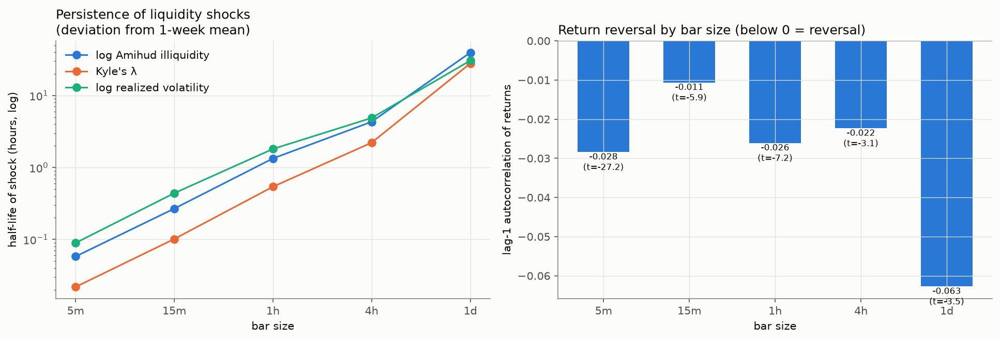
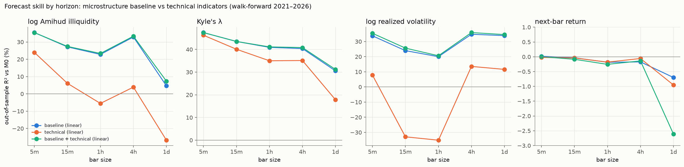
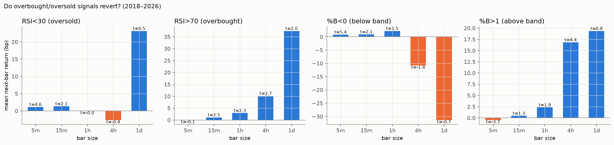
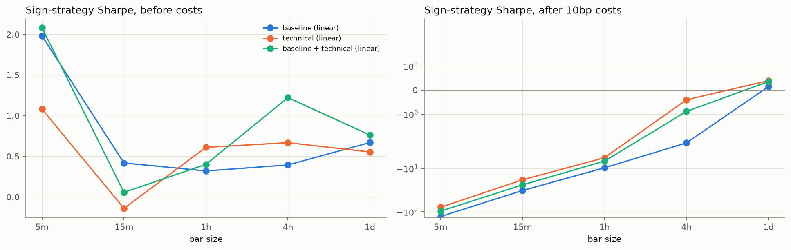

# 시간 단위별 예측 분석 — 평균회귀성 · 예측 성능 · 기술지표 vs 미시구조

- 데이터: Binance BTCUSDT 1분봉 → 5분 · 15분 · 1시간 · 4시간 · 1일 봉, 학습 2018-01-01~, 워크포워드 검증 2021~2026
- 모형: M0 기준 / **M2·M3 미시구조 베이스라인**(선형·부스팅) / **T1·T2 기술지표만**(선형·부스팅) / **C1 결합**(선형)
- 기술지표 13개: RSI, MACD 히스토그램, 볼린저 %B·밴드폭, 스토캐스틱 %K·%D, 이동평균 괴리(10/50), 200봉 괴리, ROC, ATR, OBV 기울기, 거래량 비율, MFI — 모두 업계 표준 기간 (데이터에 맞춰 조정하지 않음)
- 재현: `python src/analyze_horizons.py` / 정의: `src/technical_indicators.py`, `src/baseline_factors.py`
- 스프레드: 1분봉 기반 스프레드 추정치는 2022년 이후 무의미(1틱 ≈ 0.001bp, `results/liquidity/summary.md`)하므로 유동성 대상은 **Amihud · Kyle's λ · 변동성**으로 비교

## 1. 평균회귀성 (2018~2026 전체)

### 유동성 충격의 반감기 (시간) — '1주 평균 대비 편차'가 절반으로 줄어드는 데 걸리는 시간
|   horizon |   log_amihud |   kyle_lambda |   log_rv |
|----------:|-------------:|--------------:|---------:|
|        5m |       0.0579 |        0.0219 |   0.0894 |
|       15m |        0.268 |         0.101 |    0.439 |
|        1h |         1.34 |         0.541 |     1.81 |
|        4h |         4.31 |          2.21 |     4.88 |
|        1d |         39.6 |            28 |     30.6 |

### 수익률 되돌림 — 1차 자기상관 (음수 = 되돌림), |수익률| 자기상관 (양수 = 변동성 군집)
|   horizon |   ar1_level |   ar1_t_stat |   ar1_abs_return |
|----------:|------------:|-------------:|-----------------:|
|        5m |     -0.0284 |        -27.2 |            0.397 |
|       15m |     -0.0106 |        -5.88 |            0.378 |
|        1h |     -0.0261 |        -7.22 |              0.3 |
|        4h |     -0.0223 |        -3.09 |             0.24 |
|        1d |     -0.0627 |        -3.54 |            0.169 |

### 기술지표 과매수·과매도 신호의 되돌림 — 다음 봉 평균 수익률 (bp)
|                zone |       5m |     15m |      1h |    4h |    1d |
|--------------------:|---------:|--------:|--------:|------:|------:|
|              %B 0-1 | -0.00194 | -0.0191 | -0.0492 | 0.535 |  6.35 |
|   %B<0 (below band) |    0.851 |   0.922 |    2.19 | -10.8 | -31.3 |
|   %B>1 (above band) |   -0.482 |   0.453 |    2.35 |  16.8 |  19.4 |
|           RSI 30-70 |  -0.0191 | -0.0431 |  0.0476 |  0.35 | 0.791 |
|   RSI<30 (oversold) |     1.15 |    1.34 | -0.0294 | -2.65 |  23.1 |
| RSI>70 (overbought) |  -0.0146 |    1.08 |    2.93 |  10.1 |  37.4 |

t값:
|                zone |    5m |   15m |    1h |    4h |    1d |
|--------------------:|------:|------:|------:|------:|------:|
|              %B 0-1 | -0.09 | -0.29 | -0.19 |  0.53 |  1.03 |
|   %B<0 (below band) |  5.43 |  2.08 |  1.54 | -1.77 | -0.71 |
|   %B>1 (above band) | -3.73 |  1.27 |  1.93 |  4.36 |  0.83 |
|           RSI 30-70 | -0.89 | -0.68 |  0.19 |  0.35 |  0.13 |
|   RSI<30 (oversold) |  4.55 |  2.06 | -0.02 | -0.37 |  0.52 |
| RSI>70 (overbought) | -0.08 |  2.53 |  2.34 |  2.69 |  2.04 |

## 2. 시간 단위별 예측 성능 — 표본 외 R² (%, M0 대비)

### 유동성: log Amihud
|   horizon |   M2_base_linear |   M3_base_boost |   T1_tech_linear |   T2_tech_boost |   C1_combined_linear |
|----------:|-----------------:|----------------:|-----------------:|----------------:|---------------------:|
|        5m |             35.4 |            35.8 |               24 |            29.3 |                 35.4 |
|       15m |             27.2 |            27.1 |             6.09 |              12 |                 27.4 |
|        1h |             22.8 |            22.5 |            -5.52 |           -2.41 |                 23.4 |
|        4h |             32.9 |            31.8 |              3.9 |            5.32 |                 33.3 |
|        1d |             4.63 |           -13.5 |            -26.8 |           -29.6 |                 7.36 |

### 유동성: Kyle's λ
|   horizon |   M2_base_linear |   M3_base_boost |   T1_tech_linear |   T2_tech_boost |   C1_combined_linear |
|----------:|-----------------:|----------------:|-----------------:|----------------:|---------------------:|
|        5m |             47.4 |            47.4 |             46.3 |            46.6 |                 47.4 |
|       15m |             43.5 |            43.3 |             40.1 |            40.7 |                 43.5 |
|        1h |             40.9 |            41.2 |               35 |            35.2 |                 41.1 |
|        4h |             40.4 |            40.9 |             35.1 |            33.7 |                 40.8 |
|        1d |             30.6 |            25.6 |             17.9 |            18.8 |                 31.2 |

### 변동성: log 실현변동성
|   horizon |   M2_base_linear |   M3_base_boost |   T1_tech_linear |   T2_tech_boost |   C1_combined_linear |
|----------:|-----------------:|----------------:|-----------------:|----------------:|---------------------:|
|        5m |             33.8 |            33.8 |             7.86 |            19.1 |                 35.5 |
|       15m |               24 |            23.6 |            -32.9 |           -12.8 |                 25.6 |
|        1h |               20 |            22.6 |            -35.1 |           -22.9 |                 20.6 |
|        4h |             34.8 |            38.1 |             13.6 |            15.3 |                 35.9 |
|        1d |             33.9 |            36.3 |             11.6 |            13.3 |                 34.6 |

### 가격: 다음 봉 수익률
|   horizon |   M2_base_linear |   M3_base_boost |   T1_tech_linear |   T2_tech_boost |   C1_combined_linear |
|----------:|-----------------:|----------------:|-----------------:|----------------:|---------------------:|
|        5m |           0.0182 |          0.0292 |          -0.0224 |           0.233 |              0.00378 |
|       15m |          -0.0343 |         -0.0298 |          -0.0401 |           0.187 |               -0.085 |
|        1h |           -0.185 |           -0.47 |            -0.18 |          -0.117 |               -0.256 |
|        4h |           -0.173 |          -0.317 |          -0.0583 |          -0.657 |               -0.139 |
|        1d |             -0.7 |          -0.603 |           -0.953 |          -0.778 |                -2.61 |

시간 단위별 최고 모형
- Amihud: 5m baseline (boosting) (35.8%) · 15m baseline + technical (linear) (27.4%) · 1h baseline + technical (linear) (23.4%) · 4h baseline + technical (linear) (33.3%) · 1d baseline + technical (linear) (7.4%)
- Kyle's λ: 5m baseline (boosting) (47.4%) · 15m baseline + technical (linear) (43.5%) · 1h baseline (boosting) (41.2%) · 4h baseline (boosting) (40.9%) · 1d baseline + technical (linear) (31.2%)
- 변동성: 5m baseline + technical (linear) (35.5%) · 15m baseline + technical (linear) (25.6%) · 1h baseline (boosting) (22.6%) · 4h baseline (boosting) (38.1%) · 1d baseline (boosting) (36.3%)
- 수익률: 5m technical (boosting) (0.2%) · 15m technical (boosting) (0.2%) · 1h technical (boosting) (-0.1%) · 4h technical (linear) (-0.1%) · 1d baseline (boosting) (-0.6%)

## 3. 기술지표의 추가 예측력 — C1(결합) − M2(베이스라인) R² 차이 (%p)

|                         |      5m |      15m |      1h |     4h |    1d |
|------------------------:|--------:|---------:|--------:|-------:|------:|
|  log Amihud illiquidity | -0.0237 |     0.27 |   0.556 |  0.451 |  2.73 |
|                Kyle's λ | -0.0146 | 0.000249 |    0.21 |  0.432 | 0.644 |
| log realized volatility |    1.68 |     1.66 |   0.592 |   1.12 |  0.67 |
|         next-bar return | -0.0144 |  -0.0506 | -0.0703 | 0.0333 | -1.91 |

## 4. 가격 예측 상세 (방향 · 경제적 가치)

수수료 편도 10bp. 방향 검정은 Pesaran–Timmermann (예측·실제가 독립일 때 기대 적중률 대비).

|                               |   oos_r2_vs_M0 |   clark_west_p |   hit_rate |   hit_rate_if_independent |   pesaran_timmermann_p |   gross_sharpe |   net_sharpe |   trades_per_day |
|------------------------------:|---------------:|---------------:|-----------:|--------------------------:|-----------------------:|---------------:|-------------:|-----------------:|
|      ('5m', 'M2_base_linear') |       0.000182 |       2.41e-10 |      0.512 |                       0.5 |                      0 |           1.98 |         -129 |              250 |
|       ('5m', 'M3_base_boost') |       0.000292 |       2.15e-06 |      0.512 |                       0.5 |                      0 |           1.86 |         -119 |              232 |
|      ('5m', 'T1_tech_linear') |      -0.000224 |       9.29e-05 |      0.517 |                       0.5 |                      0 |           1.08 |        -78.9 |              149 |
|       ('5m', 'T2_tech_boost') |        0.00233 |       2.36e-13 |      0.509 |                       0.5 |                      0 |           2.06 |        -49.8 |             94.2 |
|  ('5m', 'C1_combined_linear') |       3.78e-05 |        1.5e-12 |      0.512 |                       0.5 |                      0 |           2.08 |          -97 |              187 |
|     ('15m', 'M2_base_linear') |      -0.000343 |          0.106 |      0.504 |                       0.5 |               0.000785 |          0.418 |        -32.3 |               56 |
|      ('15m', 'M3_base_boost') |      -0.000298 |        0.00895 |      0.509 |                       0.5 |                      0 |          0.332 |        -38.2 |             66.2 |
|     ('15m', 'T1_tech_linear') |      -0.000401 |        0.00372 |      0.498 |                       0.5 |                  0.985 |         -0.141 |        -18.3 |             30.6 |
|      ('15m', 'T2_tech_boost') |        0.00187 |       1.08e-12 |      0.505 |                       0.5 |               1.67e-06 |           1.26 |        -17.6 |             31.8 |
| ('15m', 'C1_combined_linear') |       -0.00085 |        0.00331 |      0.499 |                       0.5 |                  0.855 |         0.0564 |          -24 |             40.7 |
|      ('1h', 'M2_base_linear') |       -0.00185 |           0.36 |      0.509 |                       0.5 |               1.32e-05 |           0.32 |        -9.66 |             16.1 |
|       ('1h', 'M3_base_boost') |        -0.0047 |          0.379 |       0.51 |                       0.5 |                2.9e-06 |          0.167 |        -11.7 |             19.1 |
|      ('1h', 'T1_tech_linear') |        -0.0018 |         0.0273 |      0.507 |                       0.5 |                0.00238 |           0.61 |        -5.66 |             10.1 |
|       ('1h', 'T2_tech_boost') |       -0.00117 |          2e-05 |      0.498 |                     0.501 |                  0.884 |           1.48 |        -5.11 |             10.5 |
|  ('1h', 'C1_combined_linear') |       -0.00256 |         0.0144 |      0.506 |                       0.5 |                0.00695 |          0.401 |        -6.78 |             11.5 |
|      ('4h', 'M2_base_linear') |       -0.00173 |         0.0752 |      0.505 |                       0.5 |                  0.132 |          0.393 |        -2.57 |             4.69 |
|       ('4h', 'M3_base_boost') |       -0.00317 |        0.00705 |      0.516 |                     0.501 |               0.000293 |           1.48 |        -1.78 |             5.14 |
|      ('4h', 'T1_tech_linear') |      -0.000583 |       0.000385 |      0.493 |                     0.501 |                  0.958 |          0.667 |       -0.407 |             1.69 |
|       ('4h', 'T2_tech_boost') |       -0.00657 |          0.506 |      0.502 |                     0.502 |                  0.552 |          0.468 |        -1.81 |              3.6 |
|  ('4h', 'C1_combined_linear') |       -0.00139 |       4.14e-06 |      0.493 |                       0.5 |                  0.954 |           1.22 |       -0.888 |             3.33 |
|      ('1d', 'M2_base_linear') |         -0.007 |         0.0805 |      0.505 |                       0.5 |                   0.32 |          0.669 |         0.14 |            0.823 |
|       ('1d', 'M3_base_boost') |       -0.00603 |          0.326 |       0.49 |                       0.5 |                  0.808 |         -0.222 |       -0.643 |            0.655 |
|      ('1d', 'T1_tech_linear') |       -0.00953 |          0.228 |      0.504 |                       0.5 |                  0.345 |          0.553 |        0.389 |            0.256 |
|       ('1d', 'T2_tech_boost') |       -0.00778 |          0.127 |      0.504 |                     0.499 |                  0.334 |          0.663 |        0.413 |            0.391 |
|  ('1d', 'C1_combined_linear') |        -0.0261 |          0.059 |        0.5 |                       0.5 |                  0.492 |          0.762 |         0.35 |            0.641 |

### 연도별 표본 외 R² (%) — 시간 단위 × 모형
|               |   M2_base_linear |   M3_base_boost |   T1_tech_linear |   T2_tech_boost |   C1_combined_linear |
|--------------:|-----------------:|----------------:|-----------------:|----------------:|---------------------:|
|  ('5m', 2021) |           0.0643 |           0.201 |         -0.00179 |           0.474 |                0.038 |
|  ('5m', 2022) |           0.0107 |        -0.00437 |          -0.0615 |          0.0166 |             -0.00923 |
|  ('5m', 2023) |           0.0406 |          -0.606 |          -0.0218 |         -0.0131 |                0.015 |
|  ('5m', 2024) |          -0.0535 |          0.0694 |          -0.0385 |          0.0661 |              -0.0465 |
|  ('5m', 2025) |          -0.0504 |         -0.0969 |           -0.042 |           0.189 |              -0.0546 |
|  ('5m', 2026) |          -0.0412 |         -0.0233 |           0.0209 |          0.0752 |             -0.00644 |
| ('15m', 2021) |           0.0151 |           0.023 |          -0.0192 |           0.325 |              -0.0383 |
| ('15m', 2022) |          -0.0936 |          -0.185 |           -0.112 |         0.00375 |               -0.169 |
| ('15m', 2023) |           -0.101 |         -0.0606 |          -0.0382 |            0.15 |               -0.126 |
| ('15m', 2024) |          -0.0515 |          0.0012 |          -0.0101 |          0.0961 |              -0.0855 |
| ('15m', 2025) |          -0.0625 |         -0.0166 |          -0.0621 |          0.0733 |               -0.134 |
| ('15m', 2026) |          0.00149 |          0.0591 |             0.01 |            0.27 |             -0.00013 |
|  ('1h', 2021) |           -0.244 |          -0.959 |           -0.208 |         -0.0168 |               -0.283 |
|  ('1h', 2022) |           -0.375 |          -0.532 |           -0.252 |          -0.591 |               -0.551 |
|  ('1h', 2023) |          0.00242 |         -0.0324 |           -0.119 |            0.01 |               -0.165 |
|  ('1h', 2024) |          -0.0777 |         -0.0017 |           -0.103 |          0.0412 |              -0.0918 |
|  ('1h', 2025) |          -0.0159 |         -0.0285 |           -0.187 |          -0.026 |               0.0173 |
|  ('1h', 2026) |          -0.0222 |           0.182 |          -0.0476 |           0.123 |               -0.081 |
|  ('4h', 2021) |            0.259 |           0.131 |            0.278 |          -0.948 |                  1.2 |
|  ('4h', 2022) |           -0.545 |          -0.157 |           -0.514 |          -0.319 |                -1.22 |
|  ('4h', 2023) |            -0.54 |           -1.53 |           -0.612 |           0.231 |                -1.89 |
|  ('4h', 2024) |           -0.297 |           -0.43 |            0.602 |           0.175 |                0.292 |
|  ('4h', 2025) |           -0.642 |           -1.26 |           -0.672 |          -0.649 |                -1.67 |
|  ('4h', 2026) |           -0.149 |          -0.113 |           -0.398 |           -2.87 |                -1.05 |
|  ('1d', 2021) |          -0.0646 |           0.155 |             -1.3 |           -0.26 |               -0.663 |
|  ('1d', 2022) |            -2.67 |          -0.557 |             -0.9 |          -0.611 |                -3.26 |
|  ('1d', 2023) |            -1.66 |           -1.27 |           -0.649 |           -1.03 |                  -11 |
|  ('1d', 2024) |             1.33 |           -1.52 |           -0.375 |           -1.01 |                -1.26 |
|  ('1d', 2025) |            -1.18 |          -0.668 |            -2.88 |            -2.5 |                   -5 |
|  ('1d', 2026) |           0.0363 |           -1.27 |             1.01 |          -0.705 |                 1.66 |

## 그림

| | |
|---|---|
|  |  |
|  |  |
