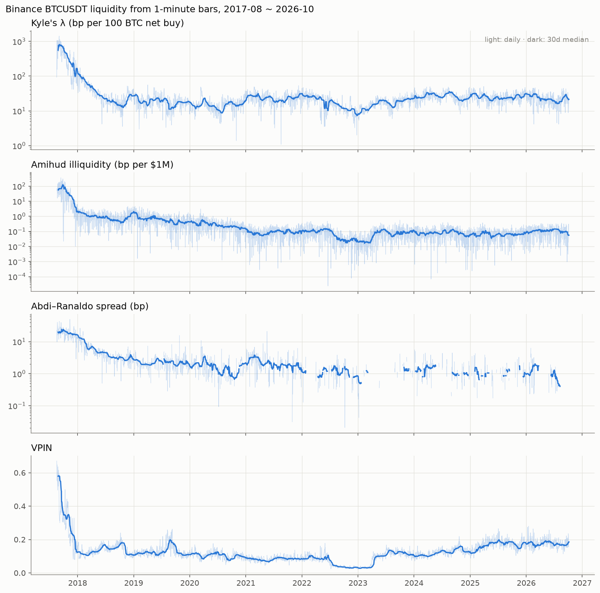
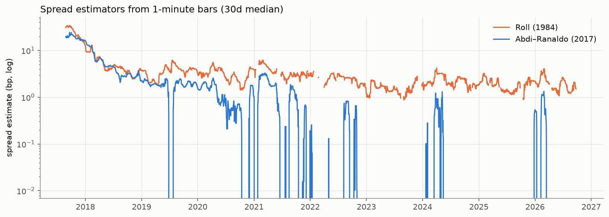
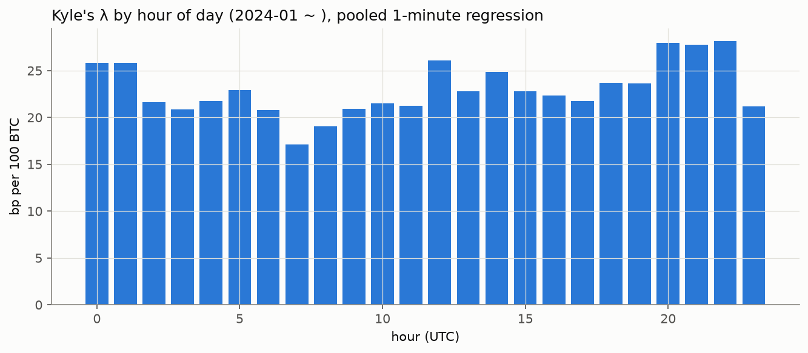
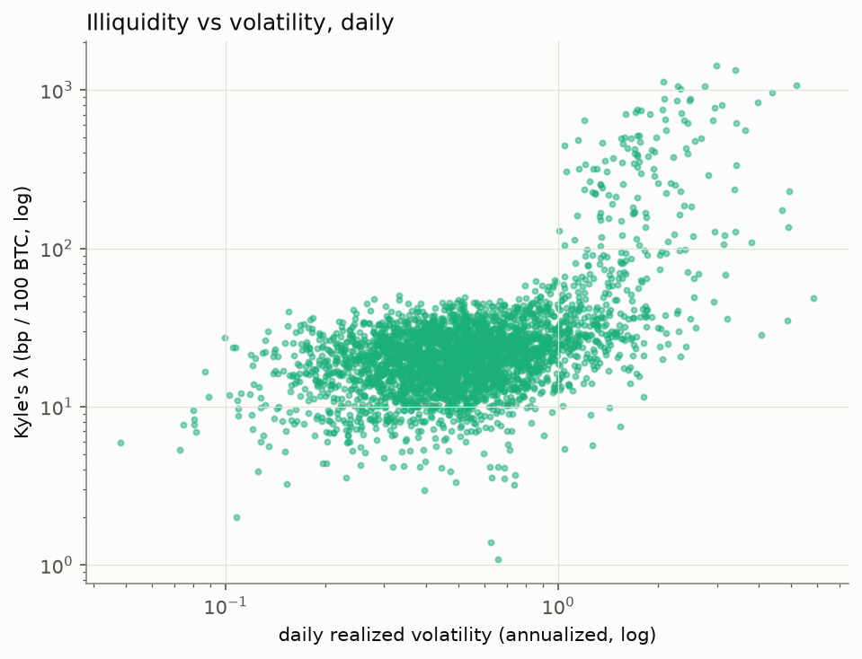
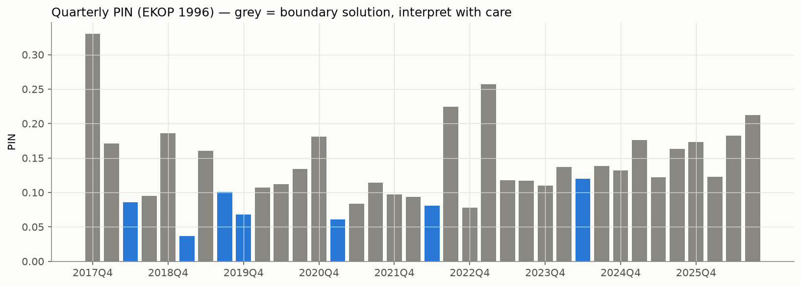

# Binance BTCUSDT 유동성 지표 (1분봉 근사)

- 데이터: Binance BTCUSDT 1분봉 2017-08-18 ~ 2026-10-06 UTC, 3,337일
- 하루 1200분 미만 남은 날(거래소 점검 등) 14일은 지표 제외
- 재현: `python src/analyze_liquidity_klines.py` / 지표 정의: `src/liquidity_metrics.py`
- 호가 데이터 없이 1분봉으로 만든 **근사치** — 실시간 호가창 기반 정밀 지표는 `results/orderbook/summary.md`

## 1. 연도별 중앙값

|   year |   kyle_lambda_bps_per_100btc |   kyle_r_squared |   amihud_bps_per_musd |   roll_spread_bps |   abdi_ranaldo_spread_bps |    vpin |   realized_vol_ann |   usd_volume_musd |
|-------:|-----------------------------:|-----------------:|----------------------:|------------------:|--------------------------:|--------:|-------------------:|------------------:|
|   2017 |                        303.9 |          0.03444 |                 19.39 |                22 |                     17.83 |  0.3043 |               1.72 |             10.09 |
|   2018 |                        26.56 |           0.2086 |                0.8917 |             4.248 |                     4.003 |  0.1346 |             0.6904 |             242.3 |
|   2019 |                        18.33 |           0.2059 |                 0.526 |             3.482 |                     1.879 |  0.1201 |             0.5318 |             268.1 |
|   2020 |                        14.67 |           0.2668 |                0.2274 |             2.911 |                    0.8612 |  0.1036 |             0.5226 |             614.5 |
|   2021 |                        23.53 |           0.1976 |               0.08385 |             3.501 |                     1.153 |   0.083 |             0.7395 |             2,931 |
|   2022 |                        15.88 |            0.299 |               0.05171 |             2.488 |                         0 | 0.06017 |             0.5311 |             2,664 |
|   2023 |                        16.88 |           0.3935 |               0.05976 |             1.577 |                         0 |  0.1037 |             0.3573 |             1,306 |
|   2024 |                        26.06 |           0.3396 |               0.07319 |             2.111 |                         0 |  0.1209 |             0.4682 |             1,921 |
|   2025 |                        25.03 |           0.2592 |               0.06318 |             1.865 |                         0 |  0.1696 |             0.3686 |             1,811 |
|   2026 |                        21.89 |            0.229 |                0.1049 |             1.884 |                         0 |  0.1752 |             0.3838 |             1,233 |

- `kyle_lambda_bps_per_100btc`: 순매수 100 BTC가 1분 수익률을 몇 bp 움직이는가 (클수록 비유동)
- `amihud_bps_per_musd`: 거래대금 100만 달러당 일 수익률 bp
- `roll_spread_bps` / `abdi_ranaldo_spread_bps`: 1분봉 가격 움직임으로 역산한 스프레드 추정치
- `vpin`: 거래량 버킷 주문 불균형 (0~1)

> **스프레드 추정치의 한계**: Abdi–Ranaldo 추정치가 0인 날의 비율이 71%(2022년 이후)다.
> BTCUSDT 실제 스프레드는 거의 항상 1틱(0.01달러 ≈ 현재 0.0012bp)으로, 1분봉이 구분할 수 있는 크기보다
> 훨씬 작기 때문이다. Roll 추정치(약 2bp)도 스프레드가 아니라 1분 단위 가격 되돌림 잡음을 잡는 것으로 봐야 한다.
> → **최근 구간의 스프레드는 실시간 호가창 데이터로만 측정 가능.** 1분봉 지표 중에서는 Kyle's λ, Amihud, VPIN이 유효.

## 2. 지표 간 상관 (일별, 스피어만 순위상관)

|                            |   kyle_lambda_bps_per_100btc |   amihud_bps_per_musd |   roll_spread_bps |   abdi_ranaldo_spread_bps |   vpin |   realized_vol_ann |   usd_volume_musd |
|---------------------------:|-----------------------------:|----------------------:|------------------:|--------------------------:|-------:|-------------------:|------------------:|
| kyle_lambda_bps_per_100btc |                            1 |                  0.14 |              0.34 |                      0.19 |   0.16 |               0.41 |             -0.10 |
|        amihud_bps_per_musd |                         0.14 |                     1 |              0.44 |                      0.44 |   0.24 |               0.33 |             -0.60 |
|            roll_spread_bps |                         0.34 |                  0.44 |                 1 |                      0.72 |   0.10 |               0.71 |             -0.24 |
|    abdi_ranaldo_spread_bps |                         0.19 |                  0.44 |              0.72 |                         1 |   0.08 |               0.35 |             -0.42 |
|                       vpin |                         0.16 |                  0.24 |              0.10 |                      0.08 |      1 |              -0.11 |             -0.39 |
|           realized_vol_ann |                         0.41 |                  0.33 |              0.71 |                      0.35 |  -0.11 |                  1 |              0.12 |
|            usd_volume_musd |                        -0.10 |                 -0.60 |             -0.24 |                     -0.42 |  -0.39 |               0.12 |                 1 |

## 3. 시간대별 Kyle's λ (2024-01 이후, UTC)

- 가장 비유동적: 22시 (28.13 bp/100 BTC), 가장 유동적: 7시 (17.11 bp/100 BTC)

|   hour_utc |   kyle_lambda_bps_per_100btc |   t_stat |   r_squared |   n_minutes |
|-----------:|-----------------------------:|---------:|------------:|------------:|
|          0 |                        25.85 |    36.33 |      0.2611 |      60,600 |
|          1 |                        25.84 |    19.49 |        0.28 |      60,600 |
|          2 |                        21.64 |    25.63 |      0.2544 |      60,600 |
|          3 |                        20.88 |    24.23 |      0.2393 |      60,600 |
|          4 |                        21.75 |    26.85 |      0.2597 |      60,600 |
|          5 |                        22.91 |    32.94 |      0.2606 |      60,600 |
|          6 |                        20.82 |    19.55 |      0.2569 |      60,600 |
|          7 |                        17.11 |    11.06 |      0.2228 |      60,574 |
|          8 |                        19.08 |    12.86 |      0.2325 |      60,540 |
|          9 |                        20.95 |    19.96 |      0.2515 |      60,540 |
|         10 |                        21.48 |    37.07 |      0.2563 |      60,540 |
|         11 |                        21.25 |    24.79 |      0.2383 |      60,540 |
|         12 |                        26.08 |    24.89 |      0.3083 |      60,540 |
|         13 |                        22.78 |    21.47 |      0.2441 |      60,540 |
|         14 |                        24.85 |    28.99 |        0.26 |      60,540 |
|         15 |                        22.79 |    25.52 |      0.2414 |      60,540 |
|         16 |                        22.36 |    29.04 |      0.2323 |      60,540 |
|         17 |                        21.78 |    14.64 |      0.2249 |      60,540 |
|         18 |                        23.71 |    25.42 |      0.2396 |      60,540 |
|         19 |                        23.62 |    26.92 |      0.2406 |      60,540 |
|         20 |                        27.94 |    22.41 |      0.2793 |      60,540 |
|         21 |                        27.78 |    10.36 |      0.2742 |      60,540 |
|         22 |                        28.13 |    19.84 |      0.3201 |      60,540 |
|         23 |                        21.18 |    12.51 |       0.216 |      60,540 |

## 4. 분기별 PIN

- 경계해(α 또는 δ가 0·1에 붙음) 비율: 81% — 하루 체결 수십만 건에서 Poisson 가정이 어긋나는 알려진 문제.
  PIN은 진단용으로만 쓰고 고빈도 비교에는 VPIN을 함께 본다.

|   quarter |     pin |   alpha |      delta |   boundary_flag |
|----------:|--------:|--------:|-----------:|----------------:|
|    2017Q4 |  0.3301 |  0.2826 |  3.118e-10 |            True |
|    2018Q1 |  0.1708 |  0.4778 |          1 |            True |
|    2018Q2 | 0.08594 |  0.3517 |      0.625 |           False |
|    2018Q3 | 0.09473 |  0.4348 |          0 |            True |
|    2018Q4 |  0.1856 |  0.3696 |  9.401e-11 |            True |
|    2019Q1 | 0.03646 |  0.1111 |        0.3 |           False |
|    2019Q2 |  0.1602 |  0.3407 |  7.066e-91 |            True |
|    2019Q3 |   0.101 |  0.2826 |    0.07693 |           False |
|    2019Q4 | 0.06814 |  0.1848 |     0.9412 |           False |
|    2020Q1 |   0.107 |  0.2198 |          1 |            True |
|    2020Q2 |   0.112 |  0.3626 |          1 |            True |
|    2020Q3 |  0.1343 |  0.4239 |          1 |            True |
|    2020Q4 |  0.1811 |     0.5 |          1 |            True |
|    2021Q1 | 0.06049 |     0.3 |      0.963 |           False |
|    2021Q2 | 0.08338 |  0.2857 |          1 |            True |
|    2021Q3 |  0.1145 |  0.4457 |  6.733e-12 |            True |
|    2021Q4 |  0.0971 |  0.3913 |          1 |            True |
|    2022Q1 | 0.09377 |  0.3444 |   6.71e-10 |            True |
|    2022Q2 | 0.08043 |  0.1539 |     0.1428 |           False |
|    2022Q3 |  0.2242 |  0.7717 |   2.46e-25 |            True |
|    2022Q4 | 0.07766 |  0.2066 |          1 |            True |
|    2023Q1 |  0.2571 |     0.7 | 8.284e-134 |            True |
|    2023Q2 |  0.1178 |  0.3956 | 2.097e-126 |            True |
|    2023Q3 |  0.1171 |  0.3804 |          1 |            True |
|    2023Q4 |  0.1102 |  0.4457 |          1 |            True |
|    2024Q1 |   0.137 |  0.3736 |  3.093e-08 |            True |
|    2024Q2 |  0.1198 |  0.3407 |     0.9677 |           False |
|    2024Q3 |  0.1385 |  0.3152 |          1 |            True |
|    2024Q4 |  0.1319 |  0.3044 |          1 |            True |
|    2025Q1 |  0.1757 |  0.3555 |          1 |            True |
|    2025Q2 |  0.1219 |  0.3187 | 5.266e-119 |            True |
|    2025Q3 |   0.163 |  0.5109 |          1 |            True |
|    2025Q4 |  0.1735 |  0.4782 |          1 |            True |
|    2026Q1 |  0.1227 |  0.2778 |          1 |            True |
|    2026Q2 |  0.1823 |  0.4945 |          1 |            True |
|    2026Q3 |  0.2119 |  0.5761 |  5.386e-14 |            True |

## 그림

| | |
|---|---|
|  |  |
|  |  |
|  | |
