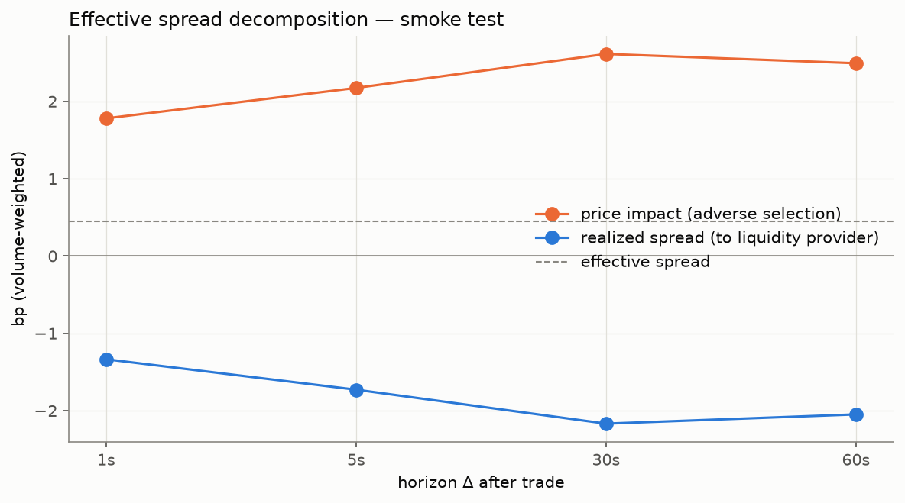
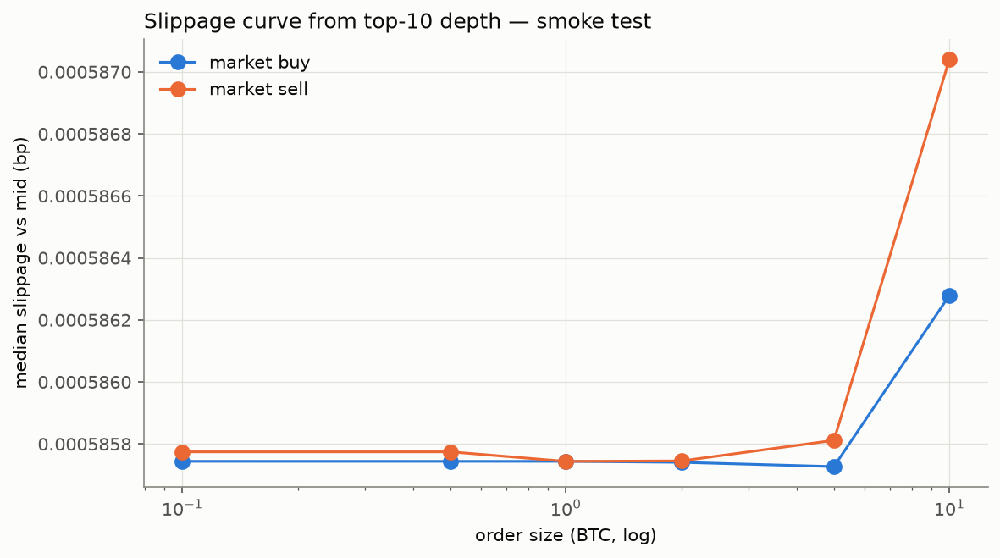
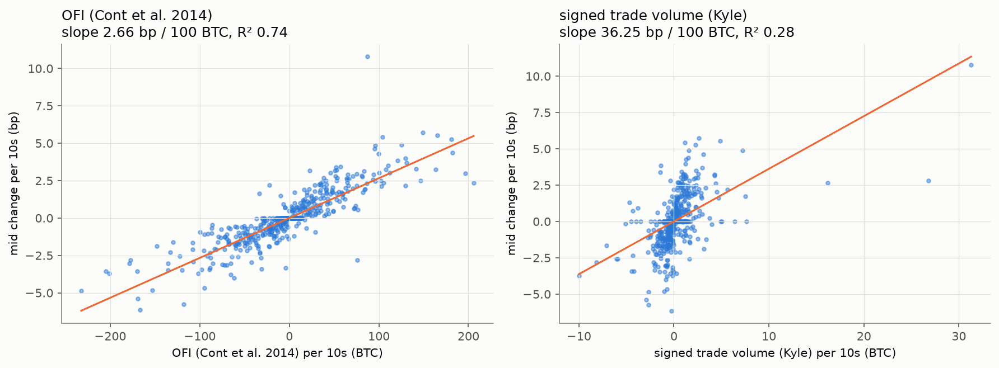

# 실시간 호가창 유동성 지표 (host=smoketest)

- 구간: 2026-09-22 05:22:52 ~ 07:10:05 UTC (107분)
- 호가 갱신 649,607건, 체결 59,310건, 최대 수집 공백 864초
- 재현: `python src/analyze_liquidity_orderbook.py --host smoketest` / 지표 정의: `src/liquidity_metrics.py`
- ⚠️ 표본이 짧아 수치 자체보다 **계산 파이프라인 검증** 목적. VPS 수집분이 쌓이면 다시 실행.

## 1. 호가 스프레드 (시간 가중)

|                                 |    value |
|--------------------------------:|---------:|
|                   quote_updates |  649,607 |
| time_weighted_mean_spread_ticks |    1.069 |
|   time_weighted_mean_spread_bps | 0.001252 |
|         share_of_time_at_1_tick |   0.9995 |
|                max_spread_ticks |    2,531 |
|           mean_best_bid_qty_btc |    3.015 |
|           mean_best_ask_qty_btc |    4.304 |

## 2. 유효 스프레드 분해 (거래량 가중, bp)

유효 스프레드 = 실현 스프레드(유동성 공급자 몫) + 가격 충격(역선택 비용)

|   horizon_s |   n_trades |   effective_spread_bps |   price_impact_bps |   realized_spread_bps |   median_effective_spread_bps |   median_price_impact_bps |
|------------:|-----------:|-----------------------:|-------------------:|----------------------:|------------------------------:|--------------------------:|
|           1 |     59,309 |                 0.4451 |               1.78 |                -1.335 |                      0.001174 |                    0.8045 |
|           5 |     59,309 |                 0.4451 |              2.174 |                -1.729 |                      0.001174 |                     1.403 |
|          30 |     59,309 |                 0.4451 |              2.613 |                -2.168 |                      0.001174 |                     1.411 |
|          60 |     59,309 |                 0.4451 |              2.493 |                -2.048 |                      0.001174 |                     1.872 |

## 3. 슬리피지 곡선 (상위 10단계 호가 기준)

|                |   mean_bps |   median_bps |   p95_bps |   book_too_thin_share |
|---------------:|-----------:|-------------:|----------:|----------------------:|
|   ('buy', 0.1) |   0.001487 |    0.0005857 | 0.0005872 |               0.02027 |
|   ('buy', 0.5) |   0.001388 |    0.0005857 | 0.0005873 |                0.1156 |
|   ('buy', 1.0) |   0.001045 |    0.0005857 | 0.0005873 |                0.1846 |
|   ('buy', 2.0) |  0.0008779 |    0.0005857 | 0.0005873 |                0.2725 |
|   ('buy', 5.0) |   0.001063 |    0.0005857 | 0.0006189 |                  0.56 |
|  ('buy', 10.0) |   0.004613 |    0.0005863 |   0.01877 |                 0.835 |
|  ('sell', 0.1) |   0.001829 |    0.0005858 | 0.0005872 |               0.03685 |
|  ('sell', 0.5) |   0.001138 |    0.0005858 | 0.0005872 |                0.1272 |
|  ('sell', 1.0) |  0.0007389 |    0.0005857 | 0.0005871 |                0.2074 |
|  ('sell', 2.0) |  0.0009609 |    0.0005857 | 0.0005873 |                 0.309 |
|  ('sell', 5.0) |   0.001449 |    0.0005858 |  0.001913 |                0.6765 |
| ('sell', 10.0) |    0.01099 |     0.000587 |   0.04706 |                0.9399 |

> 상위 10단계는 가격으로 고작 10 틱(≈ $0.10) 범위다.
> 10 BTC 주문은 스냅샷의 94%에서 보이는 잔량이 모자라 계산 불가 → 큰 주문의 슬리피지를 보려면
> 더 깊은 호가가 필요 (개선안: REST 호가 스냅샷 주기 수집 또는 diff-depth 스트림으로 전체 호가창 유지).

## 4. 가격 충격 회귀 (10s 구간, 이분산 강건 t값)

|         order_flow_measure |   slope_bps_per_btc |   slope_bps_per_100btc |   t_stat_robust |   r_squared |   n_intervals |
|---------------------------:|--------------------:|-----------------------:|----------------:|------------:|--------------:|
|     OFI (Cont et al. 2014) |             0.02665 |                  2.665 |           24.24 |      0.7389 |           548 |
| signed trade volume (Kyle) |              0.3625 |                  36.25 |           6.212 |      0.2841 |           548 |

## 그림

| | |
|---|---|
|  |  |
|  | |
